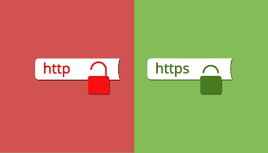
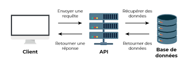
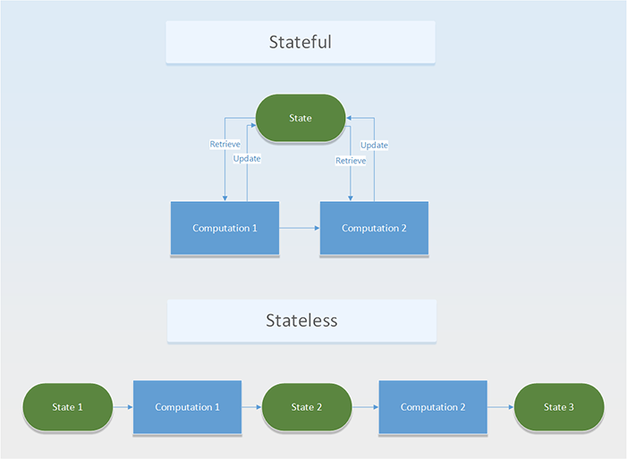
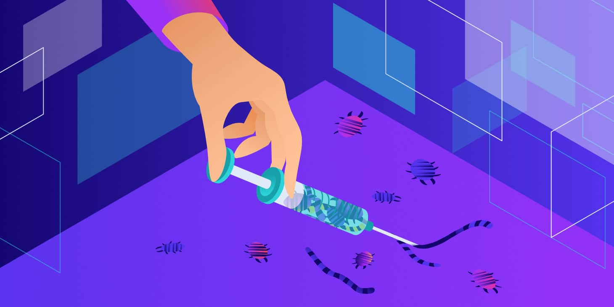

# Security CDA 

## HTTPS && ! HTTP

La mise en place de HTTPS sur un site ou une application web est une garantie de sécurité qui repose sur TLS pour assurer la confidentialité et l’intégrité des informations échangées, ainsi que l’authenticité du serveur contacté.

La mise en place de HTTPS a pour objectif :
 de garantir, autant que possible, l’authenticité du site consulté ;
 de garantir également l’intégrité et la confidentialité des données échangées en bloquant les attaques de type Man-In-The-Middle

 ## CORS (Cross-Origin Resource Sharing),SOP (Same-Origin Policy),CSP (Content Security Policy)

### CORS

Il est parfois nécessaire de contourner la SOP (stratégie de sécurité par défaut du navigateur) afin de permettre l’appel de ressources en dehors de l’Origin telles que peuvent en fournir des services web tiers de météo ou d’actualités par exemple. La méthode utilisée dans ce cas est nommée Cross- Origin Resource Sharing. 

### SOP

L’objectif de Same-Origin Policy (SOP) est de fournir un cadre de contrôle des interactions possiblement effectuées par les éléments embarqués dans une page web. SOP est une contrainte implémentée par tous les navigateurs du marché. Cette contrainte ne signifie pas que toutes les res- sources doivent provenir d’une même Origin, mais impose des restrictions dans la communication entre composants lorsque ceux-ci ont des Origins différentes.

### CSP

Content Security Policy (CSP) permet de définir une stratégie de contrôle des accès aux res- sources atteignables d’un site web donné par l’application de restrictions sous forme de liste d’autorisations.

La maîtrise de l’ensemble des ressources récupérées par un site web permet de réduire le risque d’apparition et l’exploitabilité de vulnérabilités XSS, abordées plus en détails en section.

## systeme de hachage et de salage

Le stockage des mots de passe des utilisateurs par le vérifieur doit être réalisé de manière sécurisée. En effet, en cas de compromission de cette base (cette base a été récupérée ou rendue publique par un attaquant), les mots de passe seront directement révélés s’ils sont stockés en clair. Ainsi, ce sont les empreintes des mots de passe qu’il faut conserver plutôt que les mots de passe eux- mêmes. Le stockage des mots de passe en clair doit être absolument proscrit. Ces empreintes, aussi appelées hachés, sont le résultat d’une fonction de hachage cryptographique 

## Cookies

Les cookies ont de multiples usages : ils peuvent servir à mémoriser votre identifiant client auprès d'un site marchand, le contenu courant de votre panier d'achat, la langue d'affichage de la page web, un identifiant permettant de tracer votre navigation à des fins statistiques ou publicitaires, etc.

## API

Une API, ou interface de programmation d’application, permettent à votre produit ou service de communiquer avec d'autres produits et services sans connaître les détails de leur mise en œuvre.

Envoyer json 80% DU TEMPS

## API STATELESS

Un processus ou une application sans état est indépendant. Il ne stocke pas de données et ne fait référence à aucune transaction passée. Chaque transaction est effectuée à partir de rien, comme si c'était la première fois. 

Par exemple, une recherche en ligne pour répondre à une question quelconque est une transaction sans état. Vous tapez votre question dans le moteur de recherche et appuyez sur Entrée. Si votre transaction est accidentellement interrompue ou fermée, vous devez en démarrer une nouvelle. Les transactions sans état sont comparables à des distributeurs automatiques : une seule requête et une seule réponse. 

## API STATEfull

Les applications et processus avec état, quant à eux, peuvent être réutilisés indéfiniment. Les plateformes bancaires en ligne et les messageries en sont deux exemples. Les transactions précédentes sont prises en compte et peuvent affecter la transaction actuelle. C'est pour cela que les applications avec état utilisent les mêmes serveurs chaque fois qu'elles traitent une requête d'un utilisateur. 

La majorité des applications que nous utilisons au quotidien sont des applications avec état. Toutefois, les technologies évoluent et les microservices ainsi que les conteneurs facilitent le développement et le déploiement d'applications dans le cloud. 

## Tokens

Les jetons d'identification sont utilisés dans l'authentification basée sur les jetons pour mettre en cache les informations de profil utilisateur et les fournir à une application cliente, offrant ainsi de meilleures performances et une meilleure expérience. L'application reçoit un jeton d'identification après qu'un utilisateur s'est authentifié avec succès, puis consomme le jeton d'identification et en extrait les informations de l'utilisateur, qu'elle peut ensuite utiliser pour personnaliser l'expérience de l'utilisateur. 

## injection SQLi

SQL (Structured Query Language) est un langage qui nous permet d’interagir avec des bases de données. Les applications Web modernes utilisent des bases de données pour gérer les données et afficher un contenu dynamique aux lecteurs.

L’injection SQL, ou SQLi, est une attaque sur une application web en compromettant sa base de données par des déclarations SQL malveillantes.

